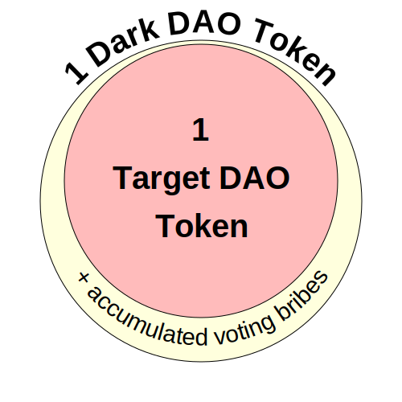

# Dark DAO
Dark DAOs are a new way to build trustworthy vote-buying systems targeting other
DAOs using key encumbrance. Our implementation of two kinds of Dark DAOs written
entirely in Solidity demonstrate how simple it can be to set one up.

This repository contains the Dark DAO systems described in our paper,
[DAO Decentralization: Voting-Bloc Entropy, Bribery, and Dark DAOs](https://arxiv.org/abs/2311.03530).

In this repository, we show two different Dark DAO "flavors":
* A **Basic Dark DAO** that demonstrates simple vote-buying between a briber and vote sellers. Vote sellers must store their DAO tokens inside an encumbered account that is controlled by a key-encumbered wallet smart contract.
* A user-friendly **Tokenized Dark DAO "Lite"** that automatically sells user voting power at auction. It is accessible to ordinary users via a liquid ERC-20 DAO token derivative. Key encumbrance is managed entirely by the Dark DAO contract.

## Details
In order for trustworthy DAO vote-selling to be possible, the private key of the
account holding the DAO tokens must be both generated and encumbered inside a
trusted execution enclave (TEE) and enrolled in an *encumbrance policy* which
may restrict which voting messages its owner can sign. This way, when voting
power is sold, the holder of the DAO tokens cannot change or override the
vote-buyer's votes. To that end, we use Oasis Sapphire as a backend to store key
material and further hide vote-selling activities.

### How does it work?
The **Basic Dark DAO** provides a simple, straightforward mechanism for selling
DAO voting power to another party. Importantly, this kind of vote-selling is
largely *invisible* to outside observers, since the DAO tokens remain in the
vote-seller's account. In this type of Dark DAO, a briber sets up a Basic Dark
DAO contract to swing a particular DAO proposal, funds it, and publicizes it.
The briber specifies exactly how much users would be paid if they let the briber
vote using their DAO tokens. Users who own DAO tokens in an encumbered account
and who are already enrolled in a special DAO voting encumbrance policy can take
the bribe and sell their votes.

We aren't sure how many people would go through the effort of managing their
Ethereum account on a smart contract on another chain just to sell their DAO
votes. The **Tokenized Dark DAO "Lite"** allows users to purchase and hold an
ERC-20 DAO token derivative (a *DD token*) on Ethereum that is redeemable for
the underlying target-DAO token plus bribe money which the Dark DAO accumulates
from selling votes. The Dark DAO contract manages all key-encumbered wallets
for users and runs its own auction for every DAO proposal, allowing anyone to
bid to purchase the Dark DAO's votes. The Dark DAO itself still runs on
Oasis, but users could just buy the DD token on ordinary Ethereum token
markets and leave to arbitrageurs the task of converting the tokens and
interacting with Oasis.



## Test out a tokenized Dark DAO Lite locally
See the [TokenizedDarkDAO class](scripts/tokenized-dark-dao.ts).

We'll release a front-end interface soon.

## Run test cases locally
Requirements:
* Docker
* NodeJS
* geth

First, install the dependencies:
```
npm i
```

Run an Oasis Sapphire dev environment:
```
docker run -it -p8545:8545 -p8546:8546 ghcr.io/oasisprotocol/sapphire-dev -to "0x72A6CF1837105827077250171974056B40377488"
```

Note that these accounts are ephemeral and will be lost when you restart. Also, the TEE environment in the development environment is simulated.

The tokenized Dark DAO test cases require a local development network using `geth`:
```shell
cd geth-devnet
# Create a network using the genesis.json file
./init_geth_devnet.sh
# Run the dev network
./run_geth_devnet.sh
```

Run the test cases:
```shell
npx hardhat test --network dev
```

### Contributions
TypeScript code formatting:
```
npx xo --fix
```

Solidity code formatting:
```
npm run format-solidity
```

### Acknowledgements
The [elliptic curve contracts](contracts/elliptic-curve) are based on [elliptic-curve-solidity](https://github.com/witnet/elliptic-curve-solidity) under the MIT license.

The tokenized Dark DAO uses [Proveth](https://github.com/lorenzb/proveth) in its Dark DAO contract to verify proofs of DAO token balances on Ethereum.

### Disclaimer
The source code contained in this repository has not been audited. It is an
academic prototype. Our smart contracts might contain serious bugs.
Key-encumbrance policies and Dark DAOs are novel concepts,
so there are not yet any established standards or best practices to
assist with safe deployment.
